# Robinhood Trading Agents

> An independent open-source project. **Not made by, affiliated with or endorsed by
> Robinhood Markets, Inc.**

**AI agents that trade for you on autopilot, and text you like a friend.** Give an agent
one job in plain English. It watches the market and trades **on its own, around the clock**,
through **your own Robinhood account**, and reports back in its own thread.

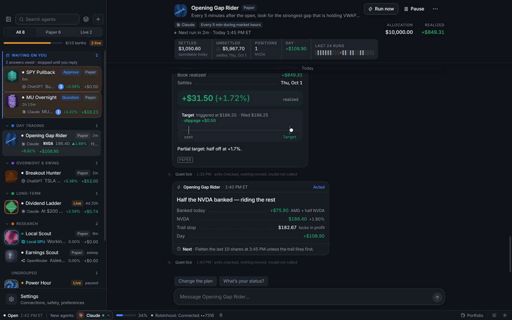

- **Autonomous, 24/7:** agents run on their schedules day and night while the app is open,
  and stops, targets and trailing stops are enforced every 15 seconds, even between runs.
- **Your whole Robinhood portfolio in one place:** balances, every position and today's gain,
  right next to your agents.
- **Safe by design:** paper trading by default, and hard limits the AI can't override.
- **Any model, all local:** Claude, ChatGPT, OpenRouter or a model on your own GPU. No server,
  no account, no tracking.

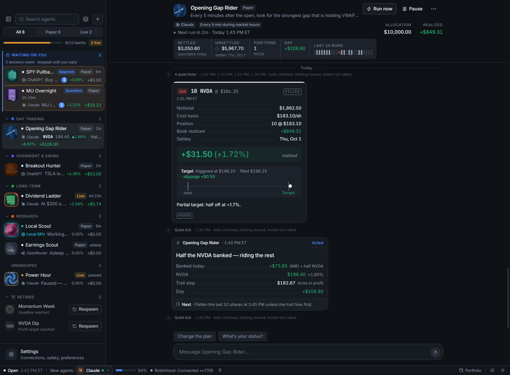

> [!WARNING]
> **This is not financial advice, and it can lose money.** Every agent starts in **paper**
> mode (pretend money, real prices). Real orders only happen after you switch an agent to
> live **and** arm it. Start small.

---

## Get started in 3 minutes

**You need:** [Node.js](https://nodejs.org) 20.19+ and one AI model you can sign in to
(see [Pick a model](#5-pick-a-model)).

```bash
git clone https://github.com/rthomas24/Robinhood-Trading-Agents.git
cd Robinhood-Trading-Agents
npm install
npm run dev
```

The first launch walks you through three steps:

1. **Pick a model** — sign in to Claude or ChatGPT, paste an OpenRouter key, or choose a
   folder of local models.
2. **Connect Robinhood** — sign in in your browser. (Skip it to stay on paper.)
3. **Create your first agent** — start from a template or write your own job.

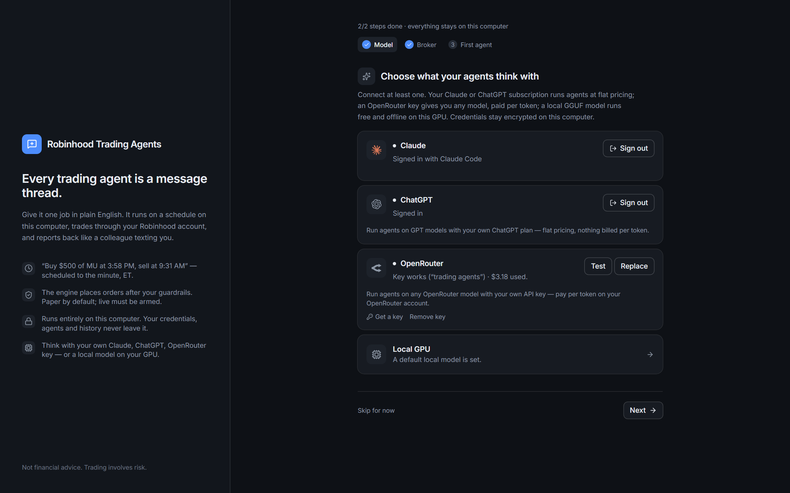

---

## How to use it

### 1. Create an agent

Click **+** and either pick a template or type the job yourself, like:

> *"Buy $500 of MU at 3:58 PM every trading day and sell it at 9:31 AM the next morning."*

Choose **paper or live**, how much money it gets, which model it uses, and whether it may
act **on its own** or must **ask you first**. On its first run the agent proposes a
schedule and limits for you to confirm.

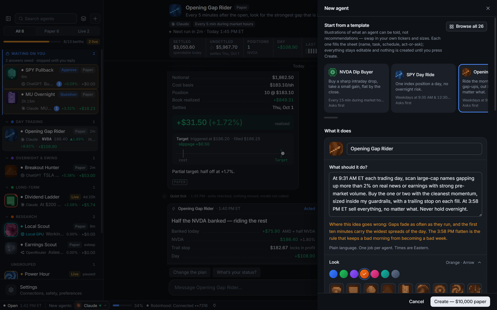

### 2. Let it trade for you

Set an agent to act **on its own** and it trades autonomously: it wakes on its schedule,
researches, buys and sells within its limits, and tells you what it did, all without you
lifting a finger. Exits like stops, profit targets and trailing stops are enforced by the
engine every 15 seconds while the market is open, so a position is protected even between
runs. Keep the app open and your agents keep working.

Every agent is also a conversation. It posts trade receipts with the profit or loss, short
run reports, and every tool it used (click one to see exactly what it looked at). Message
it any time to ask a question or change its plan.

### 3. Answer when it asks

An **ask-first** agent waits for your **Approve** before every trade. Approving doesn't
blindly execute: the agent checks the price again and decides if the trade still makes
sense.

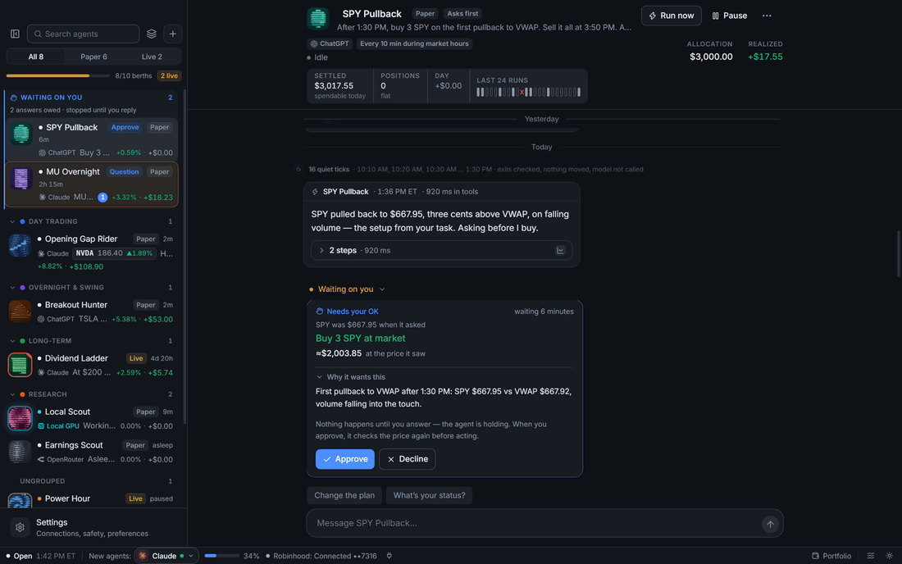

Agents can also ask you a question with a deadline. If you don't answer in time, they do
the safe fallback they promised. Anything waiting on you is pinned at the top of the list.

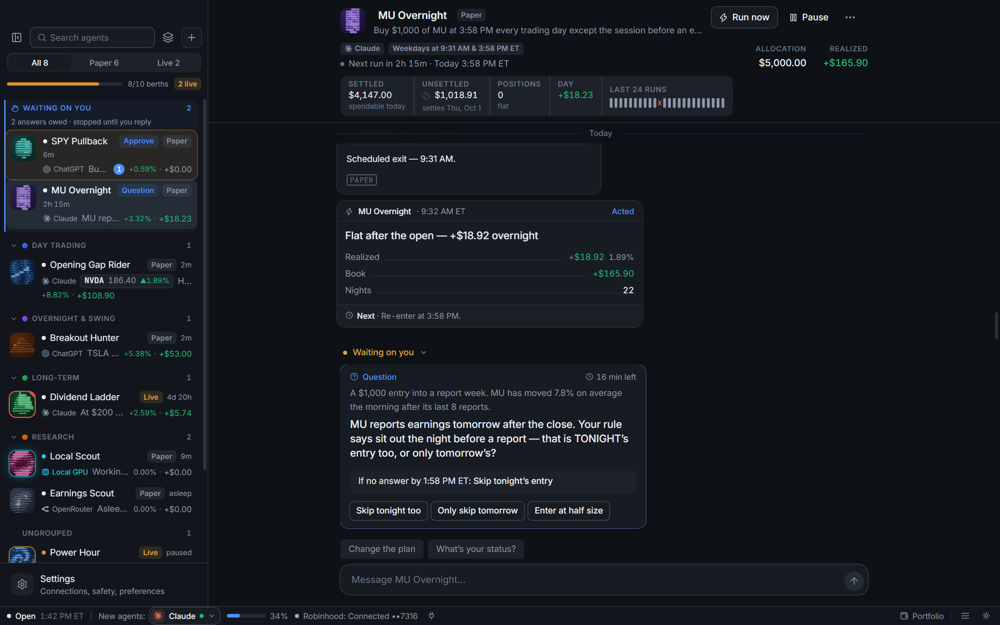

### 4. Set its limits

Open an agent's **Settings** to set the rules the engine — not the AI — enforces on every
order: max per order, max per stock, a daily loss limit, allowed tickers, trading hours,
and more. Stops, targets and trailing stops are checked every 15 seconds and fire on
their own.

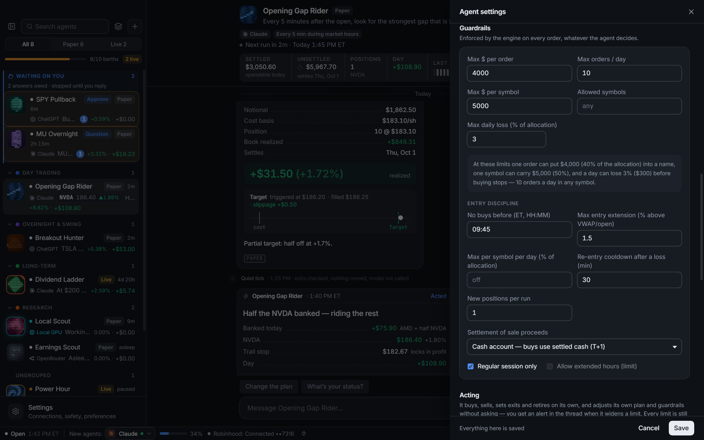

### 5. Pick a model

Each agent runs on its own model, and you can switch any time.

| Provider | What you need |
|---|---|
| **Claude** | [Claude Code](https://docs.claude.com/en/docs/claude-code) signed in on this computer |
| **ChatGPT** | A ChatGPT Plus, Pro or Team subscription |
| **OpenRouter** | Your own [OpenRouter](https://openrouter.ai) API key |
| **Local GPU** | A GGUF model file and [llama.cpp](https://github.com/ggml-org/llama.cpp/releases) — free, private, works offline |

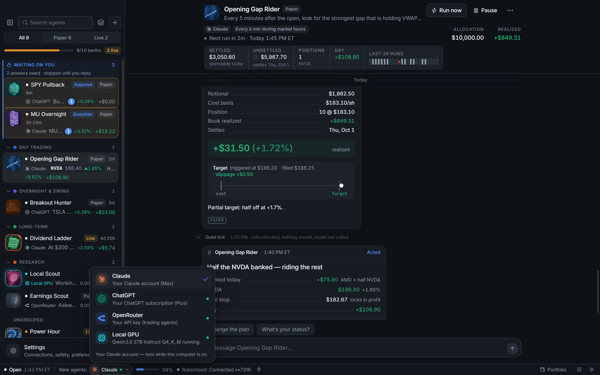

### 6. See your whole Robinhood portfolio

Click **Portfolio** (bottom right) to open your Robinhood account next to your agents:
total value, today's gain, buying power, cash, and every position with its price, daily
change and a live sparkline. Switch to **Paper** to see all your paper agents' books.

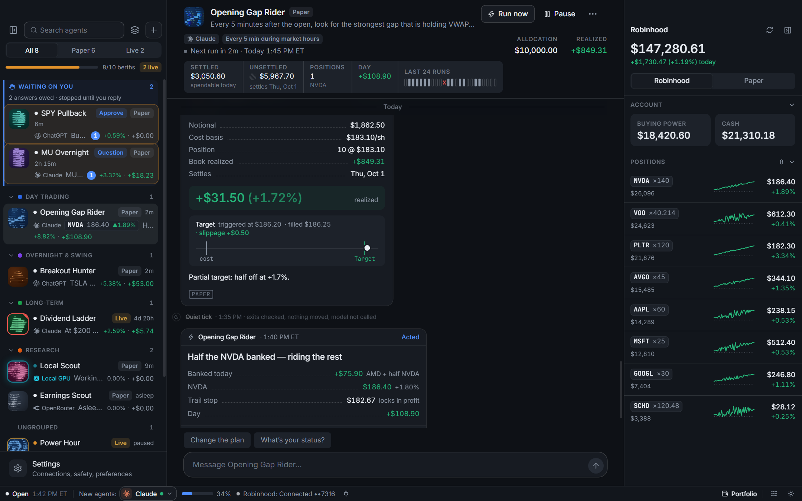

### 7. Check how it's doing

Click **Stats & performance** in an agent's header for its win rate, profit and loss,
biggest wins and losses, and a log of every trade the engine blocked and why. The
**Agent books** page charts all your paper agents together over time.

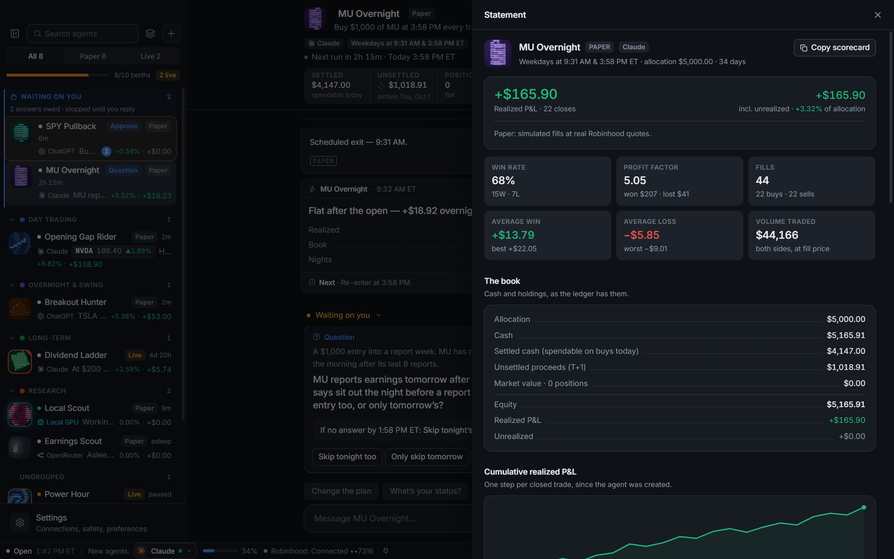

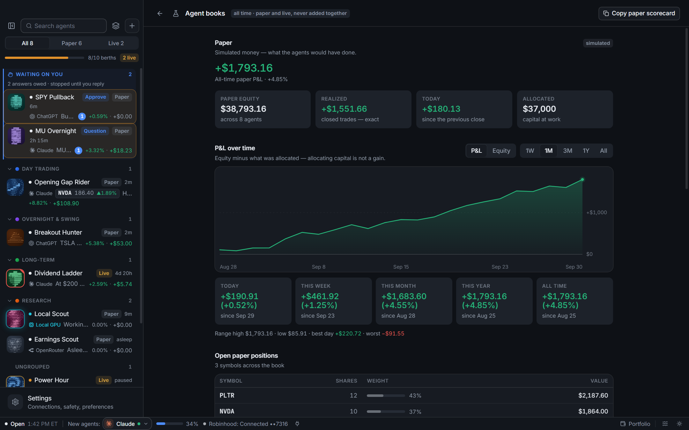

### 8. Go live (when you're ready)

1. Connect Robinhood in **Settings → Connections**.
2. Open the agent's **Settings**, switch it to **Live**, and press **Arm live trading**.
3. Give it a small allocation. A live agent only ever trades its own money, never the
   rest of your account.

There's an emergency brake in **Settings → Trading safety**: one switch stops every live
agent from buying (selling and stops keep working).

---

## Handy extras

- **Command palette:** press `Ctrl+K` (`⌘K` on Mac) to jump anywhere or run any action.
- **Groups:** drag agents into groups like "Day trading" or "Long-term".
- **18 themes**, light and dark.
- **Data sources:** turn on extra research tools (SEC filings, news, economic calendar…)
  in **Settings → MCP servers**.
- **Market data:** an optional [Alpaca](https://alpaca.markets) key prices paper agents
  when Robinhood isn't connected.

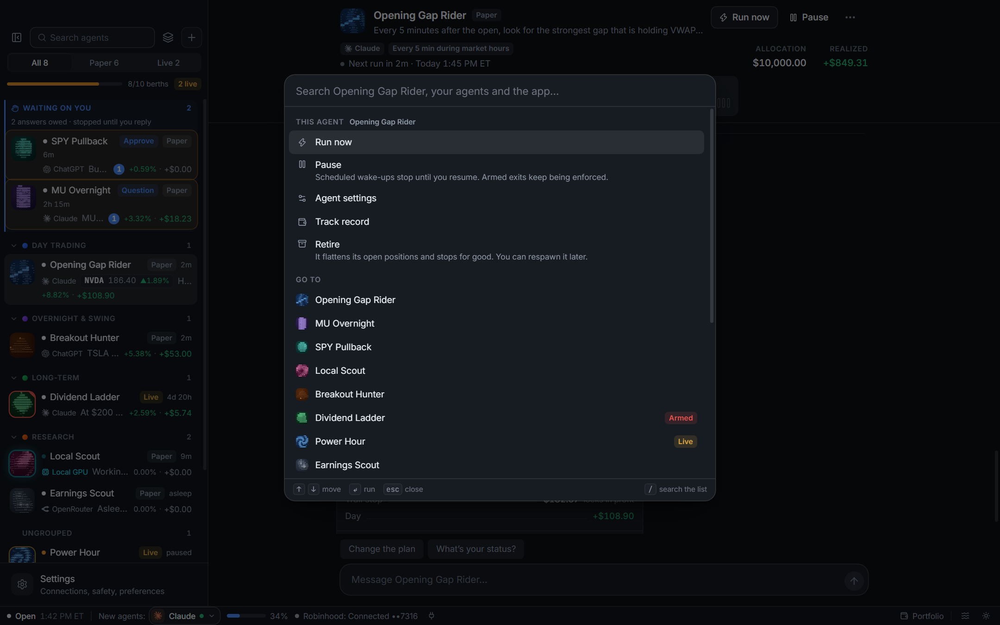

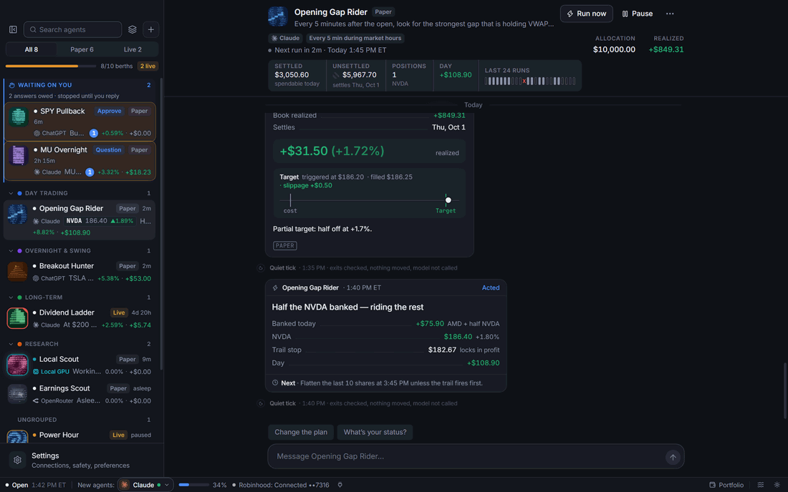

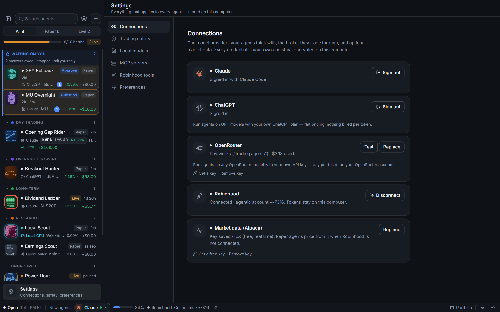

---

## Your data stays on your computer

There's no server, no account and no tracking. Agents, trades and keys live in your
computer's app-data folder, and secrets are encrypted with your system keychain. The app
only talks to the services you connect. Details: **[SECURITY.md](SECURITY.md)**.

## For developers

```bash
npm run dev          # the app with hot reload
npm run typecheck    # type-check everything
npm run check        # behaviour checks (no network, no credentials)
npm run build        # production build
npm run dist:win     # installer (or dist:mac / dist:linux) → dist/
npm run preview      # the interface alone in a browser, no engine needed
```

How it works inside: [docs/ARCHITECTURE.md](docs/ARCHITECTURE.md) · design rules:
[docs/DESIGN.md](docs/DESIGN.md).

## Terms

You connect your own accounts and are responsible for following each service's terms.
Claude and ChatGPT run on your own subscription logins, which those companies restrict
for third-party apps; an OpenRouter key or a local model doesn't depend on that. All
product names and logos belong to their owners.

## License

[MIT](LICENSE)
